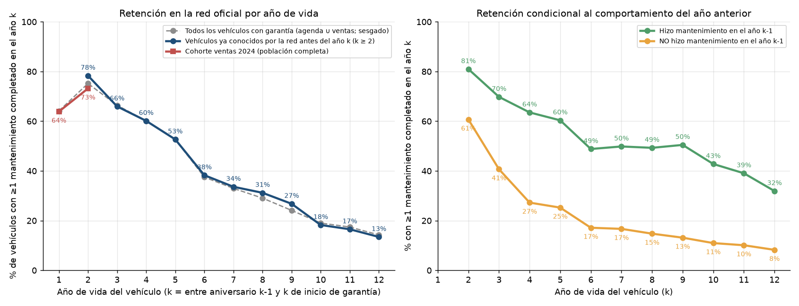
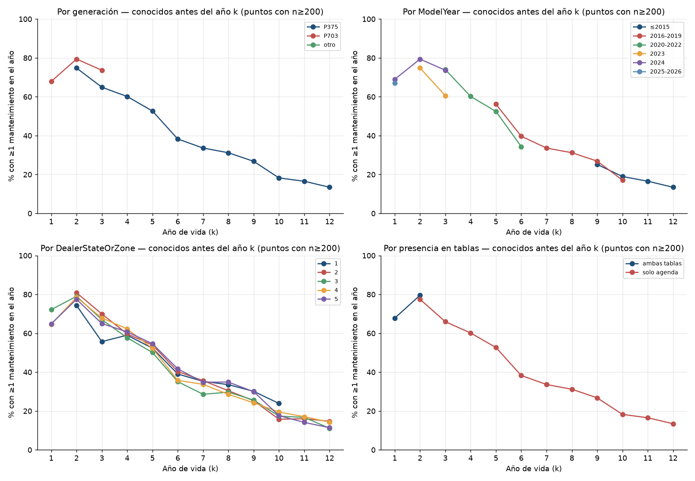
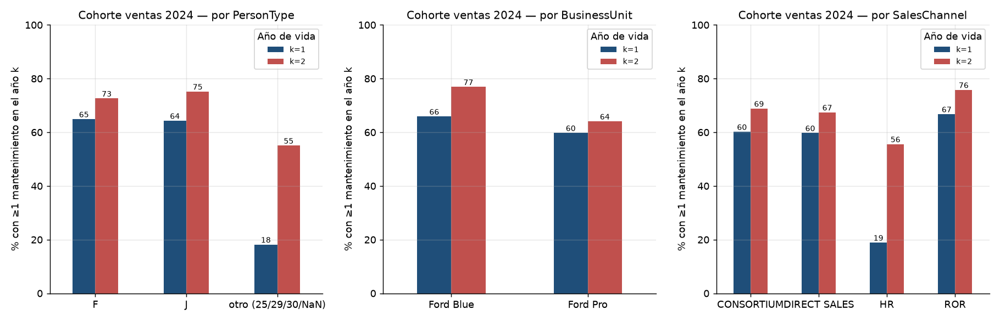
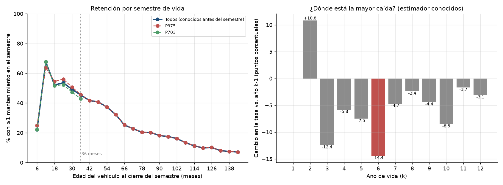
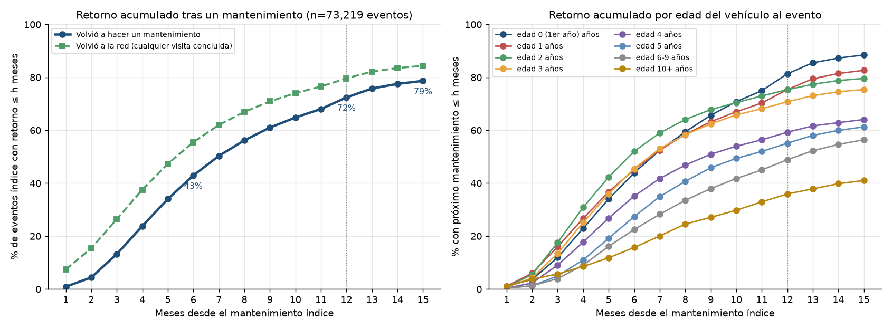
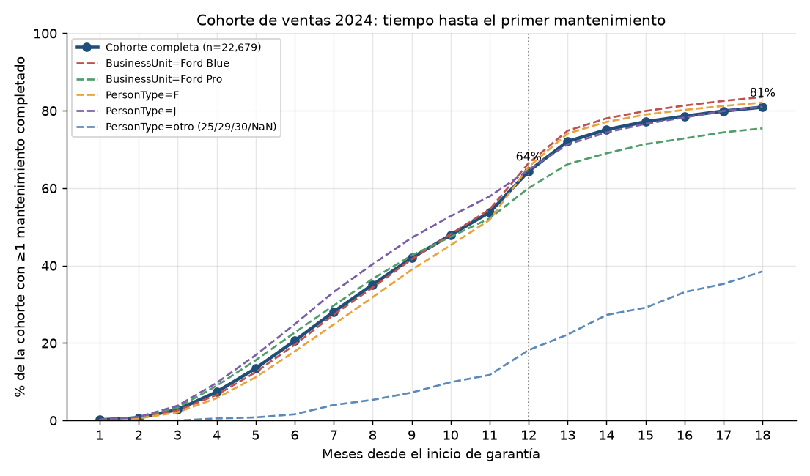
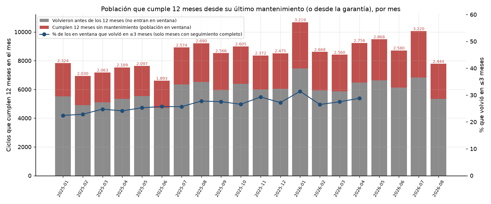
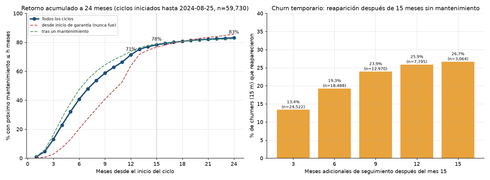

# EDA 03 — Retención por edad del vehículo y tasa base de churn

Script reproducible: `scripts/eda/03_retencion_churn.py` (genera todas las tablas en
`reports/eda/tables/03_retencion_churn_*.csv` y las figuras en `reports/figures/eda/03_retencion_churn_*.png`).
Fuente: `repurchase.eventos.appointments()` (agenda a nivel turno, `CUTOFF = 2026-08-25`) y `repurchase.io.load_sales()`.
Ventana observada: `[2024-01-01, 2026-08-25]`. Todos los porcentajes de este informe salen de esas tablas.
Verificación independiente: `reports/eda/03_retencion_churn_verificacion.md` (script
`scripts/eda/03_retencion_churn_verificacion.py`, tablas `reports/eda/tables/03_retencion_churn_verificacion_*.csv`).
Los ajustes que introdujo están marcados con **[verif.]** y citan esas tablas.

## Resumen ejecutivo

1. **La retención cae con la edad del vehículo de forma sostenida, no en un escalón.** Cohorte de ventas 2024
   (población completa): 63,9 % hace ≥1 mantenimiento en el 1er año de vida y 73,2 % en el 2°. Para vehículos ya
   conocidos por la red: 66,0 % en el 3er año, 60,1 % en el 4°, 52,7 % en el 5°, 38,3 % en el 6°, 26,8 % en el 9°,
   13,4 % en el 12° (figura 1).
2. **"Al tercer año cae fuerte" es cierto a medias.** La primera caída grande es del año 2 al 3 (−12,4 pp, de 78,3 % a
   66,0 %), pero buena parte es composición de generaciones: el año 2 es 77 % P703 y el año 3 es 88 % P375. Dentro de
   P703 (la única generación con años 2 y 3 bien poblados) la caída es de −4 a −6 pp; dentro de P375 el año 2 está
   mal estimado (ver 2.1) **[verif.]**. La mayor caída absoluta está del año 5 al 6 (−14,4 pp, de 52,7 % a 38,3 %) y
   se mantiene con un estimador de ventana previa homogénea (−14,0 pp). En la curva semestral no hay quiebre a los
   36 meses (−3,8 pp en 30→36 m, −3,8 pp en 36→42 m, −4,4 pp en 24→30 m); el descenso más marcado por semestre
   después del 1er año está a los 60→66 meses (−7,1 pp). El umbral de 100.000 km lo cruza la mediana de vehículos
   entre el 4° y 5° año (mediana de KM al service: 98.118 km en el año 4, 105.366 en el año 5).
3. **Tasa base de churn tras un mantenimiento (73.219 eventos índice, jul-2024 → may-2025):** 27,6 % no completa otro
   mantenimiento en 12 meses; 24,2 % en 13 meses; 21,3 % en 15 meses. Esa prevalencia es **por evento** (un vehículo
   con varios services en el período pesa varias veces); tomando un evento por vehículo (48.372) el churn a 12 meses
   es **32,9 %** y a 15 meses 24,5 % **[verif.]**. Si se cuenta cualquier visita concluida a la red, el churn a 12
   meses baja a 20,4 %. El churn a 12 meses va de 18,7 % (vehículo en su 1er año) a 40,7 % (5° año) y 64,1 % (10+
   años); a igual edad, el número de service separa ~40 % de ~80 % de retorno (hallazgo 3.2) **[verif.]**.
4. **Primer service (cohorte ventas 2024, n = 22.679):** 64,4 % lo completa dentro de los 12 meses desde el inicio de
   garantía, 72,0 % en 13 meses, 77,2 % en 15 y 80,9 % en 18. El 9,3 % de la cohorte nunca aparece en la agenda y el
   19,1 % no completa ningún mantenimiento en 18 meses. Ford Pro (75,4 % a 18 m) retiene menos que Ford Blue
   (83,5 %); el canal HR (38,2 %) y los PersonType 25/29/30 (38,5 %) están muy por debajo del resto.
5. **El ciclo real de service es más corto que 12 meses, pero menos de lo que sugiere la mediana por evento:** 161 días
   entre mantenimientos consecutivos (p25 = 106, p75 = 245, p90 = 352) es la mediana **por par de eventos**, dominada
   por los usuarios de alto kilometraje (los vehículos con ≥3 intervalos aportan el 62 % de los pares). Por vehículo,
   la mediana del intervalo es 206 días, el uso mediano es 21.909 km/año (34.080 por evento) y el tiempo mediano hasta
   el próximo mantenimiento, sin truncar, es de 7 meses por evento y 9 por vehículo **[verif.]**. La regla "15.000 km"
   manda en la mitad de alto uso del parque; para la otra mitad opera la regla "1 año". El 29,7 % de los ciclos
   (50.193 de 169.210) llega a los 12 meses sin service.
6. **Población en ventana:** cada mes de 2025 llegan a 12 meses sin mantenimiento entre 1.893 y 3.219 vehículos
   (promedio 2.443/mes; ≈ 26 por concesionario). De ellos, solo el 15,1 % vuelve dentro del mes siguiente y el 26,5 %
   dentro de los 3 meses.
7. **Churn temporario vs definitivo:** de los que pasan 15 meses sin mantenimiento, 13,4 % reaparece dentro de los
   3 meses siguientes, 19,3 % en 6, 25,9 % en 12 y 26,7 % en 15 (n = 3.064 con ese seguimiento). El retorno acumulado
   a 24 meses se estanca en 83,2 % (78,3 % a 15 m): más allá de los 15 meses casi no hay recuperación. El cambio de
   `customer_id` al volver crece con el tiempo transcurrido (11 % si vuelve en ≤5 meses, 19 % a los 12-14, 25-31 % a
   los 15+): es un efecto de tiempo en riesgo, no una marca del churn temporario **[verif.]**.

## 0. Definiciones y universo

- **Mantenimiento completado** (`is_completed_maintenance`): turno `(60) Concluido` con ≥1 ítem de mantenimiento
  programado (`ServiceMaintenance` no nulo). Fecha = `event_date` (check-in efectivo si es coherente con el turno, si
  no la fecha del turno). Se colapsan los turnos del mismo vehículo el mismo día: 221.703 turnos → 221.368 eventos.
- **Visita concluida**: cualquier turno `(60) Concluido`, sea mantenimiento, diagnóstico, reparación o campaña.
- **Año de vida k**: intervalo `[WSD + 12·(k−1) meses, WSD + 12·k meses)` donde WSD = `WarrantyStartDate`
  (agenda primero, ventas si falta; coinciden en 41.745 de 42.150 vehículos que están en ambas tablas). Solo se
  cuentan años de vida **completamente contenidos** en la ventana observada. Con 32 meses de ventana, un vehículo
  aporta 1 o 2 años completos: 156.705 vehículo-años de 105.034 vehículos.
- **Generación**: `ShortVehicleModelGroupTreated` de la agenda (P703 incluye Raptor P703); para vehículos solo en
  ventas, por `ModelCode` (xDC y TA1 → P703; xBC/xBB → P375).

| Grupo | Vehículos | Con WarrantyStartDate | Cohorte ventas 2024 |
|---|---:|---:|---:|
| Ambas tablas | 42.211 | 42.207 | 20.897 |
| Solo agenda | 69.541 | 68.289 | 0 |
| Solo ventas | 17.173 | 17.053 | 2.140 |
| **Total** | **128.925** | **127.549** | **23.037** |

La cohorte de ventas 2024 = `SalesDate` en 2024 y WSD ≥ 2024-01-01 (23.045 ventas; se excluyen 4 unidades con
WSD 2015-2023 y 4 sin WSD). "Solo agenda" es casi toda P375 (57.078 de 69.541); "ambas tablas" es casi toda P703
(41.794 de 42.211).

Cobertura cruzada por año de inicio de garantía (`0_cobertura_por_anio_garantia`):

| Año de WSD | En agenda | En agenda y NO en ventas | En ventas | En ventas y NO en agenda | % agenda sin venta | % ventas sin agenda |
|---:|---:|---:|---:|---:|---:|---:|
| 2023 | 20.166 | 20.166 | 0 | 0 | 100 % | – |
| 2024 | 20.636 | **1.203** | 21.337 | 1.904 | **5,8 %** | 8,9 % |
| 2025 | 19.969 | 214 | 25.054 | 5.299 | 1,1 % | 21,2 % |
| 2026 | 3.096 | 78 | 12.863 | 9.845 | 2,5 % | 76,5 % |

Las ventas empiezan el 2024-01-01, así que los 20.166 vehículos con garantía 2023 solo pueden estar en la agenda.
Pero de los 20.636 con garantía 2024 que la red vio, 1.203 (5,8 %) no están en la tabla de ventas: o la tabla de
ventas no es el universo completo de Ranger 0 km 2024, o hay `vehicle_id` que no cruzan. Al revés, 1.904 de 21.337
(8,9 %) vendidos con garantía 2024 nunca aparecieron en la agenda; ese porcentaje sube con la juventud del vehículo
(21,2 % en 2025, 76,5 % en 2026: todavía no les tocó).

## 1. Curva de retención por año de vida

Hay tres estimadores, porque la muestra tiene sesgo de selección (ver 1.2):

- **Todos**: todos los vehículos con WSD (agenda ∪ ventas). Sesgado hacia arriba para k ≥ 2: los vehículos "solo
  agenda" están, por construcción, porque vinieron al menos una vez en 2024-2026.
- **Conocidos antes del año k**: vehículos cuyo primer turno en la agenda (cualquier estado) es anterior al inicio
  del año k. Es la "base de CRM" que la red ya conoce cuando empieza el año; el hecho de estar en la muestra no
  depende de lo que pase en ese año. Es el estimador operativo para k ≥ 2 (para k = 1 tiene solo 1.295 casos,
  vehículos con turno antes del inicio de garantía, no representativos).
- **Cohorte ventas 2024**: población completa (incluye los que nunca aparecieron en agenda). Sin sesgo, pero solo
  alcanza k = 1 y k = 2.

**Tabla 1 — Retención por año de vida** (`A_curva_edad`; tasa = % con ≥1 mantenimiento completado en el año k):

| k | n cohorte 2024 | Cohorte 2024 | n conocidos | Conocidos antes de k | Todos | P(maint k \| maint k−1) | P(maint k \| sin maint k−1) |
|---:|---:|---:|---:|---:|---:|---:|---:|
| 1 | 23.021 | **63,9 %** | 1.295 | 67,6 % | 64,1 % | – | – |
| 2 | 13.263 | **73,2 %** | 24.254 | **78,3 %** | 75,2 % | 81,0 % | 60,7 % |
| 3 | – | – | 16.356 | **66,0 %** | 66,4 % | 69,8 % | 40,7 % |
| 4 | – | – | 10.273 | **60,1 %** | 60,1 % | 63,5 % | 27,3 % |
| 5 | – | – | 8.275 | **52,7 %** | 52,7 % | 60,4 % | 25,2 % |
| 6 | – | – | 5.050 | **38,3 %** | 37,5 % | 48,8 % | 17,1 % |
| 7 | – | – | 4.039 | **33,6 %** | 33,0 % | 49,8 % | 16,7 % |
| 8 | – | – | 4.420 | **31,2 %** | 29,1 % | 49,3 % | 14,8 % |
| 9 | – | – | 3.622 | **26,8 %** | 24,1 % | 50,5 % | 13,1 % |
| 10 | – | – | 2.532 | **18,2 %** | 19,0 % | 42,8 % | 11,0 % |
| 11 | – | – | 1.670 | **16,5 %** | 17,4 % | 39,1 % | 10,1 % |
| 12 | – | – | 1.220 | **13,4 %** | 14,3 % | 31,9 % | 8,2 % |

Con "cualquier visita concluida" en lugar de mantenimiento (mismo estimador conocidos): 84,2 % (k=2), 70,1 % (3),
65,1 % (4), 59,3 % (5), 48,3 % (6), 44,0 % (8), 33,0 % (10), 27,2 % (12). Cohorte 2024: 72,6 % (k=1), 79,3 % (k=2).

**Hallazgo 1.1 — El pico de retención es el 2° año, no el 1°.** 63,9 % en k=1 vs 73,2 % (cohorte) / 78,3 %
(conocidos) en k=2. El 1er año es bajo porque el primer service tarda: mediana de 8 meses desde el inicio de garantía
y 19,1 % no lo hace nunca en 18 meses (sección 4). Parte del "pico" es un artefacto del corte a los 12 meses: el
primer service se concentra en los meses 12-13 (+10,6 y +7,7 pp de la curva acumulada) y esos services caen en k=2;
con un 1er año de 13 meses la tasa sería 72,0 % **[verif.]**. A partir del 2° año la curva baja todos los años.

**Hallazgo 1.2 — La conducta del año anterior es el mejor predictor disponible.** Entre los que hicieron
mantenimiento en el año k−1, la probabilidad de hacerlo en el año k es 81,0 % (k=2), 69,8 % (k=3), 63,5 % (k=4),
60,4 % (k=5) y ~49 % entre k=6 y k=9. Entre los que NO lo hicieron en k−1 es 60,7 % (k=2), 40,7 % (k=3), 27,3 %
(k=4) y ≤17 % desde k=6. El 60,7 % en k=2 sin mantenimiento en k=1 refleja el primer service "tardío" (13-24 meses).
Nótese que a partir del 6° año, la mitad de los que sí vinieron el año anterior no vuelve al siguiente.

### 1.1 Sesgo de selección: cuánto sobreestima la agenda

**Tabla 2** (`A_sesgo_seleccion`):

| k | Solo con agenda (ambas + solo agenda) | n | Cohorte 2024 completa | n | Cohorte 2024 con ≥1 turno | Conocidos antes de k | n |
|---:|---:|---:|---:|---:|---:|---:|---:|
| 1 | 71,7 % | 35.673 | **63,9 %** | 23.021 | 70,4 % | 67,6 % | 1.295 |
| 2 | 77,6 % | 33.465 | **73,2 %** | 13.263 | 79,8 % | 78,3 % | 24.254 |

**Hallazgo 1.3.** Medir la retención solo con los vehículos que aparecen en la agenda sobreestima **+6,5 pp** en el
1er año (70,4 % vs 63,9 %) y **+6,6 pp** en el 2° (79,8 % vs 73,2 %), comparando la cohorte 2024 completa con la misma
cohorte restringida a ≥1 turno **[verif.]**. Las diferencias contra la columna "solo con agenda" (+7,8 / +4,4 pp)
mezclan otro efecto: esa columna incluye vehículos con garantía 2025 en k=1 (n = 15.037, 74,1 % vs 70,0 % de los de
garantía 2024) y con garantía 2023 en k=2 (76,4 %), así que no mide solo selección
(`03_retencion_churn_verificacion_6_sesgo_seleccion`). Para k ≥ 3 no hay población completa contra
la cual medir, así que las tasas de la Tabla 1 para k ≥ 3 son **cotas superiores**: el parque real de 3+ años
incluye vehículos que dejaron la red antes de 2024 y que no vemos. La forma de la curva (descenso con la edad) es
robusta: si algo, el sesgo crece con la edad y la caída real es más pronunciada. En el pitch, el jurado tiene que
escuchar que los 63,9 % / 73,2 % son la población completa y que el resto es "la base que la red conoce".

### 1.2 Desagregaciones

**Por generación** (`A_por_generacion`, conocidos): en k=2, P375 74,8 % (n=5.584) vs P703 79,4 % (n=18.664); en k=3,
P375 64,9 % (n=14.400) vs P703 73,7 % (n=1.955). P703 retiene entre 4,6 y 8,8 pp más a la misma edad; como P703 solo
tiene hasta 3 años de vida, **toda la curva de k ≥ 4 es P375**. Esto confunde edad con generación en el tramo k=2→3.

**Por ModelYear** (`A_por_modelyear`): las curvas de 2016-2019 y 2020-2022 se superponen donde coinciden en edad
(k=5: 56,2 % vs 52,5 %; k=6: 39,7 % vs 34,4 %); la caída del 5° al 6° año se repite dentro de cada grupo, así que no
es un artefacto de mezcla de model years.

**Por DealerStateOrZone** (`A_por_zona`): diferencias chicas salvo la zona 1, que en k=3 tiene 55,7 % (n=1.944)
contra 65,0-69,9 % en las zonas 2-5; en k=2 va de 74,3 % (zona 1) a 80,9 % (zona 2). La zona no es un driver
importante de la curva.

**Por presencia en tablas** (`A_por_grupo_tabla`): en k=2, "ambas tablas" 79,6 % vs "solo agenda" 77,5 %; desde k=3
todo es "solo agenda" (los vehículos vendidos en 2024+ no llegan al 3er año dentro de la ventana).

**Cohorte ventas 2024 por atributos de venta** (`A_cohorte24_*`, figura 3):

| Atributo | Valor | n (k=1) | k=1 | k=2 |
|---|---|---:|---:|---:|
| PersonType | F | 12.583 | 64,9 % | 72,6 % |
| PersonType | J | 10.064 | 64,3 % | 75,2 % |
| PersonType | otro (25/29/30/NaN) | 374 | **18,2 %** | 55,0 % |
| BusinessUnit | Ford Blue | 15.429 | 65,9 % | 76,9 % |
| BusinessUnit | Ford Pro | 7.592 | 59,8 % | 64,1 % |
| SalesChannel | ROR | 16.014 | 66,8 % | 75,8 % |
| SalesChannel | CONSORTIUM | 3.182 | 60,2 % | 68,8 % |
| SalesChannel | DIRECT SALES | 3.370 | 59,7 % | 67,4 % |
| SalesChannel | HR | 455 | **18,9 %** | 55,6 % |
| Generación | P375 | 420 | 63,3 % | 80,0 % |
| Generación | P703 | 22.601 | 63,9 % | 73,0 % |

**Hallazgo 1.4.** Persona física y jurídica retienen igual en el 1er año (64,9 % vs 64,3 %), también dentro de cada
BusinessUnit (Ford Blue: F 66,3 % / J 68,0 %; Ford Pro: 60,4 % / 60,4 %). La diferencia está en BusinessUnit y canal:
Ford Pro retiene 6,1 pp menos en k=1 y 12,8 pp menos en k=2 que Ford Blue, y la brecha se mantiene dentro de cada
canal (ROR 62,5 % vs 68,0 %; CONSORTIUM 56,3 % vs 62,5 %). DIRECT SALES es 83 % Ford Pro (2.791 de 3.370): dentro de
Ford Pro retiene 59,5 % contra 62,5 % de ROR, así que su déficit es sobre todo el de Ford Pro; CONSORTIUM sí queda
~5,5 pp por debajo de ROR dentro de ambas unidades **[verif.]** (`03_retencion_churn_verificacion_10_*`). Los 455
vehículos del canal HR y los 374 con PersonType 25/29/30 son prácticamente el mismo grupo (371 vehículos están en
ambos) y tienen 18-19 % de retención en el 1er año: o se atienden fuera de la red de concesionarios (flotas propias,
empleados, alquiler) o son otra cosa. Hay que preguntar qué son antes de incluirlos en la población.

## 2. ¿"Al tercer año cae fuerte"? Verificación del insight del tutor

**Tabla 3 — Caída de la tasa año a año** (`B_caidas_por_k`, estimador conocidos):

| k | Tasa | Caída vs k−1 (pp) | Caída relativa |
|---:|---:|---:|---:|
| 2 | 78,3 % | +10,8 | +16,0 % |
| 3 | 66,0 % | **−12,4** | −15,8 % |
| 4 | 60,1 % | −5,8 | −8,8 % |
| 5 | 52,7 % | −7,5 | −12,4 % |
| 6 | 38,3 % | **−14,4** | **−27,4 %** |
| 7 | 33,6 % | −4,7 | −12,2 % |
| 8 | 31,2 % | −2,4 | −7,2 % |
| 9 | 26,8 % | −4,4 | −14,2 % |
| 10 | 18,2 % | −8,5 | −31,9 % |
| 11 | 16,5 % | −1,7 | −9,4 % |
| 12 | 13,4 % | −3,1 | −18,7 % |

**Hallazgo 2.1 — Dónde está la caída.** Del año 2 al 3 la tasa cae 12,4 pp (la primera caída grande desde el pico),
pero la mayor caída absoluta y relativa está del año 5 al 6: −14,4 pp / −27,4 %. Además la caída 2→3 está inflada por
composición: P703 (más retención) pesa 77 % de k=2 y solo 12 % de k=3. Dentro de P703 la caída 2→3 es −5,7 pp
(79,4 % → 73,7 %). Dentro de P375 el estimador "conocidos" da −9,9 pp, pero ese número no es robusto: el k=2 de P375
son vehículos con garantía 2023 cuya "ventana previa" observable (meses entre 2024-01 y el inicio del año k) va de 0 a
11 meses, y cuanto más corta es esa ventana más selecciona a los recién vistos (en k=3, P375 con ventana previa de
0-8 meses retiene 74,5-76,0 % y con 9+ meses 61,6-65,8 %; `03_retencion_churn_verificacion_1_conocidos_por_preventana`)
**[verif.]**. Con un estimador de ventana previa homogénea (≥1 turno en los 12 meses anteriores al año k, años
iniciados desde 2025-01) la curva es la misma —79,6 % (k=2), 66,8 % (3), 59,7 % (4), 54,0 % (5), 40,0 % (6), 20,1 %
(10), 13,8 % (12)— con caídas de −12,8 pp en 2→3 y −14,0 pp en 5→6; en P375 el 2→3 da −16,6 pp pero con n = 363 en
k=2 (`03_retencion_churn_verificacion_1_curva_edad`, `_2_caidas_por_generacion`). Conclusión defendible ante el
jurado: **la retención empieza a caer en el 3er año y se desploma entre el 5° y el 6°**; en el 6° año ya menos del
40 % de los vehículos conocidos hace un mantenimiento.

**Hallazgo 2.2 — No hay quiebre a los 36 meses.** Curva semestral (`A_curva_semestral`, % con ≥1 mantenimiento en el
semestre, conocidos): 6 m 22,2 % · 12 m 67,7 % · 18 m 52,1 % · 24 m 53,6 % · 30 m 49,2 % · **36 m 45,4 %** · 42 m
41,7 % · 48 m 40,8 % · 54 m 37,2 % · 60 m 32,3 % · **66 m 25,3 %** · 72 m 22,7 % · 84 m 20,2 % · 96 m 17,5 % · 108 m
13,3 % · 120 m 9,8 % · 144 m 7,1 %. Los cambios por semestre alrededor de los 36 meses son −3,8 pp (30→36) y −3,8 pp
(36→42), del mismo orden que el semestre anterior (−4,4 pp en 24→30) **[verif.]**. El descenso semestral más fuerte
después del 1er año está en 60→66 meses
(−7,1 pp). Si existiera un efecto "fin de garantía a los 3 años" se vería un escalón a los 36 meses, y no se ve.

**Hallazgo 2.3 — El kilometraje sí coincide con la caída.** (`B_km_por_edad`, KM declarado en el mantenimiento):

| Año de vida | n | KM p25 | KM mediana | KM p75 | % con ≥100.000 km | % con ≥150.000 km | N° service mediano |
|---:|---:|---:|---:|---:|---:|---:|---:|
| 1 | 55.719 | 24.389 | 44.029 | 68.363 | 10 % | 2 % | 1 |
| 2 | 64.012 | 32.827 | 54.531 | 85.700 | 18 % | 5 % | 3 |
| 3 | 41.598 | 48.877 | 74.798 | 112.066 | 32 % | 10 % | 5 |
| 4 | 22.765 | 63.767 | 98.118 | 137.315 | 48 % | 18 % | 8 |
| 5 | 13.846 | 73.006 | 105.366 | 144.796 | 55 % | 23 % | 9 |
| 6 | 6.829 | 80.279 | 112.434 | 157.035 | 59 % | 28 % | 10 |
| 8 | 4.175 | 97.489 | 136.253 | 183.418 | 72 % | 41 % | 11 |
| 10 | 1.656 | 112.501 | 159.800 | 215.200 | 80 % | 54 % | 13 |
| 12 | 1.001 | 128.018 | 179.697 | 244.760 | 84 % | 63 % | 15 |

La mediana de KM cruza los 100.000 km entre el 4° y el 5° año de vida; en el 3er año solo el 32 % de los
mantenimientos se hace con ≥100.000 km. Si la garantía es "3 años o 100.000 km, lo que ocurra primero", para la
mayoría de las Ranger el límite que vence primero es el de tiempo (3 años), y ahí no hay quiebre. La aceleración
de la caída en el 5°-6° año coincide con que la mayoría del parque supera los 100.000 km, pero con estos datos no se
puede separar "fin de cobertura" de "vehículo viejo con mucho uso". **No asumir la regla de garantía: preguntarla.**

**Hallazgo 2.4 — La cadencia real es más corta que 1 año, y muy heterogénea** (`B_km_anio_y_gap`): km/año implícito
(KM / edad) mediana 34.080 (p25 20.519, p75 58.232, p90 99.870); días entre mantenimientos consecutivos del mismo
vehículo: mediana 161 (p10 72, p25 106, p75 245, p90 352). Ojo: ambas son estadísticas **por evento** y los usuarios
de alto kilometraje aportan muchos eventos (los vehículos con ≥3 intervalos generan el 62 % de los pares). Por
vehículo, la mediana del intervalo es 206 días (p25 140, p75 306) y el uso mediano 21.909 km/año (p25 14.549, p75
32.504); el tiempo mediano hasta el próximo mantenimiento, sin truncar por la ventana, es 7 meses por evento y 9 por
vehículo (`03_retencion_churn_verificacion_7_*`) **[verif.]**. Con 34.000 km/año la regla de 15.000 km vence cada ~5
meses; con 22.000, cada ~8. Esto cambia el concepto de "ventana de mantenimiento": para la mitad de alto uso no es "a
los 12 meses", es "a los 15.000 km desde el último service", y el tiempo esperado depende del patrón de uso de cada
vehículo; para la otra mitad la regla de 1 año es la que opera (29,7 % de los ciclos llega a los 12 meses sin
service).

## 3. Tasa base de churn según el horizonte

Eventos índice: los 73.219 mantenimientos completados con `event_date` entre 2024-07-01 y 2025-05-25 (48.372
vehículos). Se usa 2025-05-25 y no 2025-05-31 para que **todos** los eventos tengan 15 meses completos de
seguimiento hasta el CUTOFF (2025-05-31 + 15 meses = 2026-08-31 > 2026-08-25).

**Tabla 4 — Retorno y churn por horizonte** (`C_tasa_base_horizonte`):

| Horizonte | Volvió a mantenimiento | **Churn (mantenimiento)** | Volvió a la red (cualquier visita concluida) | Churn (red) |
|---:|---:|---:|---:|---:|
| 3 m | 13,2 % | 86,8 % | 26,4 % | 73,6 % |
| 6 m | 42,9 % | 57,1 % | 55,5 % | 44,5 % |
| 9 m | 61,0 % | 39,0 % | 70,9 % | 29,1 % |
| 10 m | 64,8 % | 35,2 % | 74,1 % | 25,9 % |
| 11 m | 68,0 % | 32,0 % | 76,6 % | 23,4 % |
| **12 m** | **72,4 %** | **27,6 %** | 79,6 % | 20,4 % |
| 13 m | 75,8 % | 24,2 % | 82,2 % | 17,8 % |
| 14 m | 77,5 % | 22,5 % | 83,5 % | 16,5 % |
| **15 m** | **78,7 %** | **21,3 %** | 84,4 % | 15,6 % |

Sensibilidad: si se ignoran los retornos a <30 días del índice (609 casos, 0,8 %; posibles retrabajos o duplicados),
el retorno a 12 m es 71,6 % y a 15 m 77,8 % — cambia menos de 1 pp. Si se cuenta como retorno un turno `(90) Concluido
sin OS` con ítem de mantenimiento (3.977 turnos en la ventana, 3.659 vehículos), el retorno a 12 m sube de 72,4 % a
73,0 % (+0,6 pp) **[verif.]**. Entre los que vuelven en ≤15 meses, los días hasta el próximo mantenimiento tienen
mediana 170 (p10 75, p25 111, p75 260, p90 357).

**Unidad de análisis [verif.]** (`03_retencion_churn_verificacion_3_tasa_base`): los 73.219 eventos pertenecen a
48.372 vehículos (31.248 con un solo evento en el período, 11.799 con dos, 5.325 con tres o más). Como los que
vuelven cada 4-5 meses aportan varios eventos, la tasa por evento sobreestima la retención por vehículo: tomando el
primer evento de cada vehículo, el retorno es 67,1 % a 12 m (churn **32,9 %**), 71,7 % a 13 m y 75,5 % a 15 m (churn
24,5 %); la visita a la red a 12 m, 75,6 %. Si la unidad del modelo es "vehículo-ventana", la prevalencia correcta es
la de la Tabla 4; si se scorea cada vehículo una vez, es la de un evento por vehículo.

**Tendencia calendario [verif.]** (`03_retencion_churn_verificacion_2_retorno_por_mes_calendario`): el retorno a 12 m
por mes del evento índice es estable (73,9 % en jul-2024 → 72,1 % en may-2025), pero el retorno a 6 m cae de 46,8 % a
40,1 %: en 2025 los services se espacian más. Es un drift que la validación temporal tiene que contemplar.

**Tabla 5 — Por edad del vehículo al evento índice** (`C_tasa_base_por_edad`; edad = años completos desde WSD):

| Edad al evento | n | Volvió ≤6 m | ≤9 m | **≤12 m** | ≤13 m | **≤15 m** | Visita ≤12 m | Visita ≤15 m |
|---|---:|---:|---:|---:|---:|---:|---:|---:|
| 0 (1er año) | 18.415 | 43,9 % | 65,7 % | **81,3 %** | 85,5 % | **88,4 %** | 88,1 % | 92,8 % |
| 1 | 21.996 | 45,2 % | 63,2 % | **75,4 %** | 79,5 % | **82,7 %** | 81,7 % | 87,1 % |
| 2 | 11.507 | 52,0 % | 67,8 % | **75,3 %** | 77,4 % | **79,6 %** | 79,4 % | 83,1 % |
| 3 | 8.534 | 45,5 % | 62,4 % | **70,8 %** | 73,1 % | **75,4 %** | 77,3 % | 81,3 % |
| 4 | 4.485 | 35,1 % | 50,9 % | **59,3 %** | 61,6 % | **64,1 %** | 69,7 % | 73,8 % |
| 5 | 2.199 | 27,4 % | 45,8 % | **55,1 %** | 58,1 % | **61,3 %** | 66,2 % | 72,1 % |
| 6-9 | 5.087 | 22,5 % | 38,0 % | **48,9 %** | 52,3 % | **56,4 %** | 63,5 % | 69,9 % |
| 10+ | 668 | 15,7 % | 27,1 % | **35,9 %** | 37,9 % | **41,0 %** | 54,8 % | 58,5 % |

**Hallazgo 3.1.** El churn a 12 meses tras un mantenimiento es 18,7 % en el 1er año de vida, ~25 % en el 2°-3°,
29,2 % en el 4°, **40,7 % en el 5°**, 44,9 % en el 6°, 51,1 % en 7-10 y 64,1 % con 10+ años. El salto más grande entre
edades consecutivas está entre la edad 3 y la 4 (−11,5 pp en retorno a 12 m): consistente con la curva de la sección 1.

**Tabla 6 — Por número de service del evento índice** (`C_tasa_base_por_maint_number`):

| N° service | n | Volvió ≤6 m | ≤12 m | ≤15 m | Visita ≤15 m |
|---|---:|---:|---:|---:|---:|
| 1 | 16.731 | 27,4 % | 70,6 % | 83,0 % | 88,5 % |
| 2 | 9.842 | 37,4 % | 75,9 % | 82,9 % | 87,5 % |
| 3 | 7.018 | 44,1 % | 75,3 % | 81,0 % | 85,5 % |
| 4 | 5.828 | 47,1 % | 73,9 % | 78,8 % | 82,8 % |
| 5 | 5.270 | 45,9 % | 70,2 % | 74,3 % | 78,8 % |
| 6 | 5.100 | 47,5 % | 70,8 % | 74,9 % | 80,8 % |
| 7-8 | 7.190 | 52,3 % | 74,2 % | 77,7 % | 82,9 % |
| 9-10 | 5.748 | 54,7 % | 72,5 % | 75,5 % | 82,2 % |
| 11-19 | 9.265 | 53,8 % | 70,7 % | 73,4 % | 81,9 % |
| 20 | 1.227 | 48,4 % | 64,1 % | 65,8 % | 79,8 % |

**Hallazgo 3.2.** Visto solo, el número de service discrimina menos que la edad (retorno a 12 m entre 64 % y 76 %),
pero eso es porque edad y número de service se compensan: **a igual edad, el número de service discrimina muchísimo**
(`03_retencion_churn_verificacion_4_edad_x_maint_number_ret12m`, celdas con n ≥ 200) **[verif.]**: en el 2° año de
vida, retorno a 12 m de 45,9 % tras el 1er service vs 83,0 % tras el 3°; en el 3er año, 41,5 % (2°) vs 83,4 % (6°-10°);
en el 4°, 39,3 % (3°) vs 75,9 % (6°-10°); en el 5°, 37,4 % (4°-5°) vs 71,1 % (11°-19°). El cociente services / años
de vida (adherencia y uso acumulados) es un feature de primer orden. También cambia el *timing*: tras el 1er service
solo 27,4 % vuelve en 6 meses (el intervalo 1°→2° es más largo), mientras que con 7+ services vuelve en 6 meses más
de la mitad (usuarios de alto kilometraje). Sobre los códigos de `ServiceMaintenance`
(`03_retencion_churn_verificacion_4_servicemaintenance_vs_servicename`, `_4_km_vehiculos_jovenes_por_maint_number`):
el KM mediano y la edad mediana en turnos concluidos crecen monótonamente de 1 a 20 (código 10: 120.058 km / 44
meses; 11: 130.081 / 46; 19: 209.418 / 68; 20: 246.100 / 81), y los 747 índices de vehículos de ≤1 año con código
11-19 tienen KM mediano 147.166: los códigos 11-19 son services 11° a 19° reales (el `ServiceName` "1°", "2°"… es un
defecto de etiqueta) y el 20 se comporta como "20° o más" (tope), no como un código ajeno a la secuencia. Su menor
retorno (64,1 % a 12 m) es coherente con vehículos viejos y de altísimo kilometraje.

Por generación (`C_tasa_base_por_generacion`): P703 77,6 % a 12 m y 86,3 % a 15 m; P375 69,5 % y 74,3 %. La
diferencia es sobre todo edad (P703 tiene ≤3 años). Por presencia en tablas: "ambas" 81,9 % / 88,6 %; "solo agenda"
70,1 % / 76,2 %.

## 4. Cohorte de ventas 2024: primer mantenimiento

Cohorte: 23.037 vehículos vendidos en 2024 con WSD; se analizan los 22.679 con WSD ≤ 2025-02-25 (18 meses completos
de seguimiento). Horizonte medido desde `WarrantyStartDate`.

**Tabla 7** (`D_cohorte24_primer_service`, n = 22.679):

| Horizonte | ≥1 mantenimiento completado | 1° mantenimiento (`maint_number` = 1) | ≥1 visita concluida | ≥1 turno (cualquier estado) |
|---:|---:|---:|---:|---:|
| 6 m | 20,6 % | 20,0 % | 34,3 % | 38,5 % |
| 9 m | 42,0 % | 40,4 % | 55,2 % | 58,8 % |
| **12 m** | **64,4 %** | 61,3 % | 72,9 % | 75,9 % |
| 13 m | 72,0 % | 68,5 % | 78,6 % | 81,4 % |
| 15 m | 77,2 % | 72,5 % | 82,8 % | 85,0 % |
| 18 m | **80,9 %** | 74,8 % | 85,9 % | 87,8 % |

**Hallazgo 4.1.** El 35,6 % de los 0 km vendidos en 2024 no completó ningún mantenimiento en la red dentro de los 12
meses desde el inicio de garantía; 28,0 % a los 13 meses; 22,8 % a los 15; **19,1 % a los 18**. El 12,2 % no tomó
siquiera un turno en 18 meses. Entre los que sí lo hicieron, la mediana es 8 meses (p10 4, p25 5, p75 11, p90 13).

**Hallazgo 4.2 — El aniversario dispara el primer service.** La curva acumulada (`D_cohorte24_curva_acumulada`) sube
~6-7 pp por mes entre los meses 5 y 11 y **+10,6 pp en el mes 12** (53,8 % → 64,4 %) y +7,7 pp en el 13. En días desde
la garantía, los tramos 330-360 y 360-390 concentran 8,7 % y 9,6 % de la cohorte contra 5,8-7,6 % en cada tramo de 30
días entre los 120 y los 330, y 3,4 % en 390-420 (`03_retencion_churn_verificacion_5_dias_al_primer_service_bins30`)
**[verif.]**: para los que
no llegaron a los km, la regla "1 año" sí opera como gatillo. Esto justifica que la ventana del primer service se
abra alrededor del mes 11-12 y que un horizonte de 13 meses (72,0 %) capture ese pico.

**Hallazgo 4.3 — Diferencias por atributos de venta** (`D_cohorte24_por_*`, % con ≥1 mantenimiento):

| Segmento | n | ≤12 m | ≤13 m | ≤15 m | ≤18 m | Visita ≤18 m |
|---|---:|---:|---:|---:|---:|---:|
| PersonType F | 12.553 | 65,5 % | 74,1 % | 79,0 % | 82,1 % | 87,4 % |
| PersonType J | 9.752 | 64,7 % | 71,3 % | 76,6 % | 81,0 % | 85,3 % |
| PersonType otro (25/29/30/NaN) | 374 | 18,2 % | 22,2 % | 29,1 % | 38,5 % | 51,3 % |
| Ford Blue | 15.352 | 66,5 % | 74,8 % | 79,9 % | 83,5 % | 88,8 % |
| Ford Pro | 7.327 | 60,0 % | 66,2 % | 71,4 % | 75,4 % | 79,7 % |
| ROR | 15.941 | 67,3 % | 75,0 % | 79,8 % | 83,3 % | 88,2 % |
| CONSORTIUM | 3.173 | 61,0 % | 71,2 % | 77,1 % | 80,1 % | 85,5 % |
| DIRECT SALES | 3.110 | 59,6 % | 65,1 % | 70,9 % | 76,0 % | 79,8 % |
| HR | 455 | 18,9 % | 23,3 % | 29,7 % | 38,2 % | 50,5 % |
| P375 | 420 | 63,3 % | 71,9 % | 79,5 % | 84,8 % | 90,2 % |
| P703 | 22.259 | 64,4 % | 72,0 % | 77,1 % | 80,9 % | 85,8 % |

Las personas jurídicas hacen el primer service **antes** (a 6 meses 24,8 % vs 17,8 % de F: flotas con más km) pero
terminan parejas a 18 meses. Ford Pro y DIRECT SALES quedan 8 pp abajo a 18 meses. HR y PersonType 25/29/30: ver
hallazgo 1.4.

## 5. Población en ventana por mes

Ciclo = vehículo × punto de partida, con dos orígenes: (i) cada mantenimiento completado observado ("tras un
mantenimiento", 129.313 ciclos que vencen desde 2025-01) y (ii) el inicio de garantía para vehículos con WSD ≥
2024-01-01 que todavía no fueron ("desde inicio de garantía", 39.897). Un ciclo "vence" a los 12 meses de su inicio.
Si el vehículo completó otro mantenimiento antes, no entra en ventana (volvió antes). Los vehículos con WSD anterior
a 2024 y sin ningún mantenimiento en 2024-2026 no se pueden ubicar en un ciclo y quedan afuera.

**Tabla 8 — Ciclos que vencen por mes** (`E_poblacion_mensual`; retorno solo en meses con seguimiento completo):

| Mes | Ciclos que vencen | Volvieron antes de 12 m | **En ventana (12 m sin service)** | % en ventana | De los en ventana: volvió ≤3 m | ≤6 m | hasta CUTOFF |
|---|---:|---:|---:|---:|---:|---:|---:|
| 2025-01 | 7.831 | 5.507 | **2.324** | 29,7 % | 22,4 % | 31,0 % | 42,9 % |
| 2025-02 | 6.942 | 4.912 | 2.030 | 29,2 % | 22,9 % | 31,8 % | 43,4 % |
| 2025-03 | 7.173 | 5.110 | 2.063 | 28,8 % | 24,8 % | 31,1 % | 42,0 % |
| 2025-04 | 7.534 | 5.345 | 2.189 | 29,1 % | 24,1 % | 32,9 % | 46,2 % |
| 2025-05 | 7.628 | 5.531 | 2.097 | 27,5 % | 25,3 % | 32,9 % | 45,4 % |
| 2025-06 | 6.605 | 4.712 | 1.893 | 28,7 % | 25,7 % | 35,0 % | 46,3 % |
| 2025-07 | 8.915 | 6.341 | 2.574 | 28,9 % | 25,7 % | 34,5 % | 44,5 % |
| 2025-08 | 9.209 | 6.519 | 2.690 | 29,2 % | 27,8 % | 36,0 % | 44,6 % |
| 2025-09 | 8.523 | 5.957 | 2.566 | 30,1 % | 27,6 % | 36,6 % | 43,7 % |
| 2025-10 | 8.995 | 6.390 | 2.605 | 29,0 % | 26,6 % | 35,0 % | 41,8 % |
| 2025-11 | 8.362 | 5.990 | 2.372 | 28,4 % | 29,3 % | 36,6 % | 40,1 % |
| 2025-12 | 8.513 | 6.038 | 2.475 | 29,1 % | 27,2 % | 34,9 % | 38,5 % |
| 2026-01 | 10.676 | 7.457 | **3.219** | 30,2 % | 31,4 % | 38,8 % | 40,6 % |
| 2026-02 | 8.609 | 5.941 | 2.668 | 31,0 % | 26,5 % | – | 34,3 % |
| 2026-03 | 8.416 | 5.856 | 2.560 | 30,4 % | 27,5 % | – | 34,4 % |
| 2026-04 | 9.237 | 6.481 | 2.756 | 29,8 % | 28,8 % | – | 33,0 % |
| 2026-05 | 9.489 | 6.621 | 2.868 | 30,2 % | – | – | 28,7 % |
| 2026-06 | 8.713 | 6.133 | 2.580 | 29,6 % | – | – | 26,3 % |
| 2026-07 | 10.057 | 6.837 | 3.220 | 32,0 % | – | – | 20,2 % |
| 2026-08 | 7.783 | 5.339 | 2.444 | 31,4 % | – | – | 9,9 % |

**Hallazgo 5.1 — Dimensionamiento.** En los 16 meses con seguimiento completo (2025-01 → 2026-04) vencen en promedio
8.323 ciclos por mes y **2.443 vehículos por mes llegan a los 12 meses sin mantenimiento** (mínimo 1.893 en 2025-06,
máximo 3.219 en 2026-01; el pico de enero refleja la estacionalidad de los services de enero 2025). Con 95
concesionarios son ≈ 26 vehículos por concesionario por mes: una lista de contacto manejable. Los ~8.300 ciclos que
vencen por mes son ~8.290 vehículos distintos (`03_retencion_churn_verificacion_8_poblacion_mensual`): es el flujo
mensual de vehículos que hicieron un mantenimiento (o iniciaron garantía) 12 meses antes, y el 70 % ya volvió antes
de vencer; si la ventana se abriera antes del vencimiento (por ejemplo a los 6 meses, cuando todavía no volvió el
57 %), la población a scorear se acercaría a ese flujo **[verif.]**. Quedan afuera de este dimensionamiento 17.973
vehículos de la agenda con garantía anterior a 2024 y ningún mantenimiento completado en 2024-2026 (de 66.795 con
garantía < 2024): ya estaban fuera del ciclo cuando empieza la ventana observada y no se pueden ubicar en un ciclo
**[verif.]**.

**Hallazgo 5.2 — Llegar a 12 meses sin service ya es casi churn.** De los que cumplen 12 meses sin mantenimiento,
**15,1 % vuelve dentro del mes siguiente** (promedio 2025-01 → 2026-04; rango mensual 11,9-13,8 % en el primer
cuatrimestre de 2025), 26,5 % dentro de los 3 meses (rango 22,4-31,4 %), 31-39 % dentro de 6 meses y 40-46 % hasta el
CUTOFF (para los meses de 2025). Por origen (`E_poblacion_por_origen`): los que nunca fueron desde la garantía vuelven
más (35,9 % llega a 12 m sin service; de ellos 24,1 % vuelve en ≤1 m, 38,2 % en ≤3 m y 53,5 % hasta el CUTOFF) que los
que ya habían hecho un mantenimiento (27,7 % llega; 12,4 % vuelve en ≤1 m; 22,1 % en ≤3 m; 30,1 % hasta el CUTOFF).
Con el horizonte "el próximo mes" contado desde el vencimiento, la prevalencia de "no vuelve" es de **84,9 %** (y de
~73 % a 3 meses): el target sería mayoritario y el modelo estaría prediciendo, en la práctica, *quién sí vuelve*.

## 6. Recurrencia: churn temporario vs definitivo

Ciclos con 15 meses completos de seguimiento (inicio entre 2024-01-01 y 2025-05-25): 140.386; **churn a 15 meses:
30.205 (21,5 %)**.

**Tabla 9 — Reaparición de los churners** (`F_reaparicion`; solo churners con ≥h meses de seguimiento adicional):

| Meses adicionales después del mes 15 | Churners observables | Reaparecieron con un mantenimiento |
|---:|---:|---:|
| 3 | 24.522 | 13,4 % |
| 6 | 18.488 | 19,3 % |
| 9 | 12.970 | 23,9 % |
| 12 | 7.795 | 25,9 % |
| 15 | 3.064 | 26,7 % |

**Hallazgo 6.1.** Alrededor de **1 de cada 4 churners a 15 meses reaparece dentro del año siguiente** (25,9 % a 12
meses; la curva se aplana: 26,7 % a 15). Sobre los 30.205 churners (`F_churners_resumen`): 18,7 % reapareció hasta el
CUTOFF (seguimiento adicional mediano de 7 meses), 30,5 % tuvo alguna visita concluida que NO fue mantenimiento después
del índice (diagnóstico, reparación, campaña: no abandonaron la red, abandonaron el mantenimiento), y solo 1,1 %
tiene un turno futuro agendado después del CUTOFF. Por origen (`F_por_origen`): los churners "desde garantía" (nunca
hicieron el primer service; n = 7.376) reaparecen más (32,4 %) que los churners tras un mantenimiento (n = 22.829;
14,3 %).

**Hallazgo 6.2 — Retorno acumulado a 24 meses** (`F_retorno_acumulado_24m`; 59.730 ciclos iniciados hasta
2024-08-25): 12 m 71,3 % · 15 m 78,3 % · 18 m 80,7 % · 21 m 82,1 % · **24 m 83,2 %**. Entre los 15 y los 24 meses
solo se recupera +4,9 pp. Para la población activa, el churn "definitivo" a 2 años es ≈ 17 %, y el horizonte de 15
meses ya captura casi todo el retorno que va a ocurrir.

**Hallazgo 6.3 — Transferencias.** Entre los que vuelven después de >15 meses, el 27,5 % vuelve con un `customer_id`
distinto al del mantenimiento índice, contra 13,2 % entre los que vuelven en ≤15 meses (`F_cambio_cliente`, n = 3.259 y
84.348). Pero la tasa de cambio crece de forma continua con el tiempo transcurrido, también entre los que NO son
churners (`03_retencion_churn_verificacion_9_cambio_cliente_por_tramo`): 11,1 % si vuelve en 0-2 meses, 11,2 % en 3-5,
13,8 % en 6-8, 17,6 % en 9-11, 19,4 % en 12-14, 25,4 % en 15-17, 29,5 % en 18-20 y 31,2 % en 21+ **[verif.]**. Es
decir, el 27,5 % es sobre todo un efecto de tiempo en riesgo (más meses, más chances de transferencia o de que otro
`customer_id` tome el turno), y 3 de cada 4 retornos tardíos son del mismo `customer_id`. El cambio de dueño que
"vuelve a la rueda" (como lo describió el tutor) existe, pero no explica la mayor parte del churn temporario.

## 7. Tasas base recomendadas para el pitch

| Formulación del target | Población | Prevalencia de churn | Tabla |
|---|---|---:|---|
| No completa el próximo mantenimiento en **12 meses** tras el último | Vehículos con un mantenimiento completado (todas las edades) | **27,6 %** | 4 |
| Ídem, horizonte 13 meses / 15 meses | ídem | 24,2 % / 21,3 % | 4 |
| Ídem, 12 / 15 meses, **un evento por vehículo** **[verif.]** | 48.372 vehículos (1er evento del período) | 32,9 % / 24,5 % | verif. 3 |
| Ídem, 12 meses, por edad | 1er año / 2°-4° / 5°-6° / 7+ | 18,7 % / 25-29 % / 41-45 % / 51-64 % | 5 |
| No hace el 1er service en 12 / 13 / 18 meses desde la garantía | Cohorte 0 km 2024 (completa) | 35,6 % / 28,0 % / 19,1 % | 7 |
| No vuelve en 1 mes / 3 meses tras cumplir 12 meses sin service | Vehículos que llegan a 12 m sin service (~2.400/mes) | 84,9 % / 73,5 % | 8 |
| No vuelve nunca en 24 meses | Ciclos activos | ≈ 16,8 % | 6.2 |

Recomendación: para el modelo de scoring usar **horizonte de 12 meses desde el último mantenimiento** como definición
base (prevalencia 27,6 %, suficientemente balanceada para PR-AUC y alineada con la regla "1 año"), reportar 13 y 15
meses como sensibilidad, y tratar el "primer service" (cohorte 0 km) como una población aparte con su propia tasa
(35,6 % a 12 m) porque su curva de tiempo tiene forma distinta (pico en el mes 12-13). Si el negocio insiste en el
horizonte de "el próximo mes" contado desde la apertura de la ventana, hay que abrir la ventana **antes** del
vencimiento (por km esperado), porque una vez cumplidos los 12 meses el 73 % ya no vuelve en 3 meses.

## 8. Implicancias para target, ventana y features

- **Edad del vehículo** (años desde WSD) es la variable más fuerte de este tema: churn a 12 m de 18,7 % → 64,1 %. Los
  "3 tipos de cliente" que pide el tutor tienen un corte natural por edad: ≤3 años (retorno a 15 m ≥ 75 %), 4-6
  años (56-64 %), 7+ años (≤56 %). Sugerencia, no definición: eso lo cierra el tema de segmentación.
- **Número de service relativo a la edad** (services acumulados / años de vida) **[verif.]**: a igual edad separa
  ~40 % de ~80 % de retorno a 12 m (hallazgo 3.2). Edad y número de service tienen que entrar juntos; solos se
  compensan.
- **Comportamiento del año anterior** (hizo/no hizo mantenimiento en los 12 meses previos) separa 81 % vs 61 % en el
  2° año y 70 % vs 41 % en el 3°. Es un feature obligatorio y sin leakage si se calcula al abrir la ventana.
- **Ventana por km y por calendario**: 161 días entre services y 34.080 km/año por evento, pero 206 días y 21.909
  km/año por vehículo **[verif.]**. La fecha esperada del próximo service debería estimarse como min(último service +
  12 m, fecha en que se alcanzan +15.000 km según el ritmo de km del vehículo): para la mitad de alto uso manda el
  km, para el resto manda el año. La ventana "12 meses" describe al 29 % de los ciclos.
- **BusinessUnit / canal**: Ford Pro retiene 6 pp menos en k=1 y 13 pp menos en k=2 que Ford Blue, dentro de cada
  canal y de cada PersonType; CONSORTIUM ~5,5 pp menos que ROR dentro de cada BusinessUnit; el déficit de DIRECT SALES
  es el de Ford Pro (83 % de ese canal) **[verif.]**. PersonType F vs J no discrimina. HR y PersonType 25/29/30 (el
  mismo grupo de 371 vehículos) deberían excluirse o marcarse hasta saber qué son.
- **Generación**: P703 retiene 5-9 pp más que P375 a igual edad; como P703 es todo ≤3 años, el modelo va a confundir
  generación con edad si no se incluyen ambas.
- **Validación temporal**: los eventos índice de 2024-07 → 2025-05 con 12-15 meses de seguimiento son la base natural
  para el backtesting; los ciclos posteriores a 2025-08 no tienen 12 meses de seguimiento y no pueden etiquetarse.
  Hay drift: el retorno a 6 m cae de 46,8 % (índices de jul-2024) a 40,1 % (may-2025) aunque el de 12 m se mueve
  poco (73,9 % → 72,1 %) **[verif.]**; el split temporal tiene que ser estricto y el horizonte corto es el más
  sensible.
- **Prevalencia según unidad** **[verif.]**: 27,6 % de churn a 12 m por evento (vehículo-ventana) vs 32,9 % por
  vehículo. Definir la unidad antes de reportar la tasa base.
- **Recall a capacidad de contacto**: ~2.400 vehículos/mes llegan a 12 meses sin service (≈ 26 por concesionario);
  si se abre la ventana antes del vencimiento, la población mensual sube a ~8.300.

## 9. Problemas de calidad de datos

1. 3.790 turnos con `event_date` fuera de `[2024-01-01, 2026-08-25]` (reservas futuras `(30) Agendado` y 1 concluido)
   se excluyen.
2. 335 mantenimientos completados duplicados el mismo día para el mismo vehículo (221.703 → 221.368 eventos) y 609
   índices (0,8 %) con otro mantenimiento a <30 días: retrabajos o duplicados de carga. Impacto < 1 pp en las tasas.
3. 82 mantenimientos completados con fecha anterior al inicio de garantía del vehículo (WSD inconsistente o
   cargada tarde); se excluyen del cálculo de KM por edad.
4. `WarrantyStartDate` falta en 1.252 vehículos "solo agenda", 4 de "ambas tablas" y 120 de "solo ventas" (Tabla del
   universo); difiere entre agenda y ventas en 405 de los 42.150 vehículos vinculados que la tienen en ambas.
5. Cobertura cruzada: hay vehículos con garantía iniciada en 2024 que aparecen en la agenda y **no** están en la tabla
   de ventas (ver tabla de cobertura en la sección 0): o la tabla de ventas no cubre todo el parque 2024+ o falla el
   `vehicle_id`. Afecta a la idea de "cohorte completa" en ~5-6 %.
6. `ServiceMaintenance`: los códigos 11-19 aparecen con `ServiceName` "1°", "2°", "13°", "4°"… (etiqueta defectuosa),
   pero por KM y edad son services 11° a 19° reales; el 20 (1.227 índices, 3.502 turnos completados) tiene el KM
   (246.100) y la edad (81 meses) medianos más altos de la serie y se comporta como tope "20° o más" **[verif.]**. El
   retorno a 12 m de 64,1 % es coherente con esa población, no con un código ajeno a la secuencia.
7. `KM` tiene outliers groseros (máximo 1.536.169 en el 1er año de vida); las tablas usan mediana y cuantiles.
8. Los 1.295 vehículo-años con "primer turno antes del inicio de garantía" indican WSD posterior al primer contacto
   (entrega previa a la activación de garantía o WSD mal cargada).
9. PersonType 25/29/30 (374 vehículos en la cohorte 2024) y canal HR (455) con retención de 18-19 % en el 1er año:
   no se sabe qué son.

## 10. Preguntas para el mentor

1. ¿Cuál es exactamente la cobertura de garantía de la Ranger en Argentina (¿3 años / 100.000 km?) y hubo cambios
   por generación o año? No vemos un quiebre a los 36 meses; sí una aceleración de la caída en el 5°-6° año, cuando la
   mediana del parque supera los 100.000 km.
2. ¿Qué son el canal de venta `HR` y los `PersonType` 25/29/30? Retienen 18-19 % en el 1er año contra 64 % del resto.
   ¿Se atienden fuera de la red (flotas propias, alquiler, empleados)? ¿Van en la población a scorear?
3. La regla "15.000 km o 1 año" produce una mediana de 161 días entre services. ¿La "ventana de mantenimiento" del
   negocio se define por km esperado (patrón de uso) o por calendario? ¿Cuántos días antes del vencimiento se
   considera "abierta"?
4. Con horizonte de "el próximo mes" desde que la ventana vence, el 73 % de los vehículos no vuelve: ¿el negocio
   quiere predecir eso (mayoría) o prefiere un horizonte de 12 meses desde el último service (27,6 % de churn)?
5. ¿La tabla de ventas cubre todas las Ranger 0 km vendidas en 2024-2026 en Argentina? Hay vehículos con garantía
   2024 en la agenda que no están en ventas.
6. ¿Un turno `(90) Concluido sin OS` (19.796 ítems) cuenta como visita a la red? Acá no se contó como mantenimiento
   ni como visita concluida.
7. ¿`ServiceMaintenance = 20` es un tope ("20° o más")? ¿Y por qué los códigos 11-19 tienen `ServiceName` "1°",
   "2°", "13°"…? Por KM y edad se comportan como services 11° a 19°.
8. ¿Un mantenimiento hecho por un dueño distinto (transferencia) cuenta como retención del vehículo o como churn del
   cliente original? El 27,5 % de los que vuelven después de 15 meses lo hacen con otro `customer_id` (y el 19 % de
   los que vuelven a los 12-14 meses: la tasa crece con el tiempo transcurrido).

## Anexo — archivos generados por el script

Figuras (`reports/figures/eda/`): `03_retencion_churn_curva_edad.png`, `03_retencion_churn_curva_edad_grupos.png`,
`03_retencion_churn_cohorte24_atributos.png`, `03_retencion_churn_quiebre_tercer_anio.png`,
`03_retencion_churn_tasa_base_horizonte.png`, `03_retencion_churn_cohorte24_primer_service.png`,
`03_retencion_churn_poblacion_mensual.png`, `03_retencion_churn_recurrencia.png`.

Tablas (`reports/eda/tables/03_retencion_churn_*.csv`): `0_universo_vehiculos`, `0_cobertura_por_anio_garantia`,
`A_curva_edad`, `A_por_generacion`, `A_por_modelyear`, `A_por_zona`, `A_por_grupo_tabla`, `A_cohorte24_persontype`,
`A_cohorte24_businessunit`, `A_cohorte24_saleschannel`, `A_cohorte24_generacion`, `A_cohorte24_grupo_tabla`,
`A_sesgo_seleccion`, `A_curva_semestral`, `B_caidas_por_k`, `B_km_por_edad`, `B_km_anio_y_gap`,
`C_tasa_base_horizonte`, `C_tasa_base_por_edad`, `C_tasa_base_por_maint_number`, `C_tasa_base_por_generacion`,
`C_tasa_base_por_grupo_tabla`, `C_dias_hasta_proximo`, `C_curva_retorno_mensual`, `D_cohorte24_primer_service`,
`D_cohorte24_por_persontype`, `D_cohorte24_por_businessunit`, `D_cohorte24_por_saleschannel`,
`D_cohorte24_por_generacion`, `D_cohorte24_curva_acumulada`, `E_poblacion_mensual`, `E_poblacion_por_origen`,
`F_reaparicion`, `F_churners_resumen`, `F_por_origen`, `F_cambio_cliente`, `F_retorno_acumulado_24m`
(+ `_completa`).

Tablas de la verificación (`reports/eda/tables/03_retencion_churn_verificacion_*.csv`, generadas por
`scripts/eda/03_retencion_churn_verificacion.py`): `0_conteos`, `1_curva_edad`, `1_conocidos_por_preventana`,
`2_caidas_por_generacion`, `2_k3_P375_por_trimestre_wsd`, `2_retorno_por_mes_calendario`, `3_tasa_base`,
`3_eventos_por_vehiculo`, `4_por_edad`, `4_edad_x_maint_number_ret12m`, `4_servicemaintenance_vs_servicename`,
`4_km_vehiculos_jovenes_por_maint_number`, `5_primer_service_horizonte`, `5_curva_acumulada_9_15`,
`5_dias_al_primer_service_bins30`, `6_sesgo_seleccion`, `7_cadencia`, `7_retorno_acumulado_evento_vs_vehiculo`,
`8_poblacion_mensual`, `9_reaparicion`, `9_cambio_cliente_por_tramo`, `10_hr_x_persontype`, `10_bu_x_canal_k1`,
`10_persontype_x_bu_k1_sinHR`.
